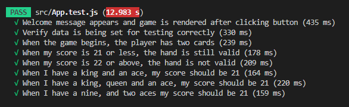

# BBC-Software-Engineer-Blackjack-Assessment

My repo for the Blackjack game, part of the technical assessment of the BBC Software Engineer Graduate Scheme. [Check it out here!](https://blackjack-game-53624.web.app/)

## Project description

A Blackjack game created using React, with the ability for the user to stand (let the dealer take cards) or hit (take cards for yourself). The game starts when the user clicks the 'start' button, and gives the user two cards. They can then hit or stand. If either the player or the dealer go over 21, they are bust and lose the game. The user can then restart the game, and play again. The user can see statistics (player wins, dealer wins, ties, and remaining cards) on the right. A leaderboard is also available, with the option to submit your score at the end of a deck.

## Assumptions made about the problem

- An ace is counted as 11 when this would not make the total more than 21.
- If there are two aces, only one can be counted as 11, and the rest as 1.
- Double down, insurance, surrender, and split are not available for the player.

## Installation

First, from your node terminal, run ```npm install requirements.txt``` to install all necessary packages. Afterwards, run ```npm start```. This runs the app in the development mode.
Open [http://localhost:3000](http://localhost:3000) to view it in your browser.
The page will reload when you make changes.

## Testing

Jest Tests has been implemented for some of the scenarios stated. The tests mock the deck to match what is being asked, and the functions to calculate score, and round status are run on the mock decks.



### Given I play a game of blackjack, when I am dealt my opening hand, then I have two cards

This test was done through Jest, through writing a test which checks the length of the players deck when starting.

### Given I have a valid hand of cards, when I choose to ‘hit’, then I receive another card, and my score is updated

This test was done manually, through starting the game, choosing the 'hit' option, and checking that I received another card, and my score was updated.

### Given I have a valid hand of cards, when I choose to ‘stand’, then I receive no further cards, and my score is evaluated

This test was done manually, through starting the game, choosing the 'stand' option, and checking that I did not receive another card, and my score was evaluated.

### Given my score is updated or evaluated, when it is 21 or less, then I have a valid hand

This test was done through Jest, by checking that when the players score is at 21, the game continues, and the hand is still valid.

### Given my score is updated, when it is over 22, then I do not have a valid hand and am 'bust'

This test was done through Jest, by checking that when the players score is at 22 or above, the game stops, and the player loses.

### Given I have a king and an ace, when my score is evaluated, then my score is 21

This test was done through Jest, by setting the players deck to contain a king, and an ace, and checking that the value of the deck was 21.

### Given I have a king, a queen and an ace, when my score is evaluated, then my score is 21

This test was done through Jest, by setting the players deck to contain a king, a queen and an ace, and checking that the value of the deck was 21.

### Given I have a nine, an ace and another ace, when my score is evaluated, then my score is 21

This test was done through Jest, by setting the players deck to contain a nine, an ace, and another ace, and checking that the value of the deck was 21.

## Libraries Used

[Firebase](https://firebase.google.com/)
[MaterialUI](https://mui.com/)
[React](https://reactjs.org/)
[Redux](https://redux.js.org/)
[UUID](https://www.npmjs.com/package/uuid)
[Jest](https://jestjs.io/)
